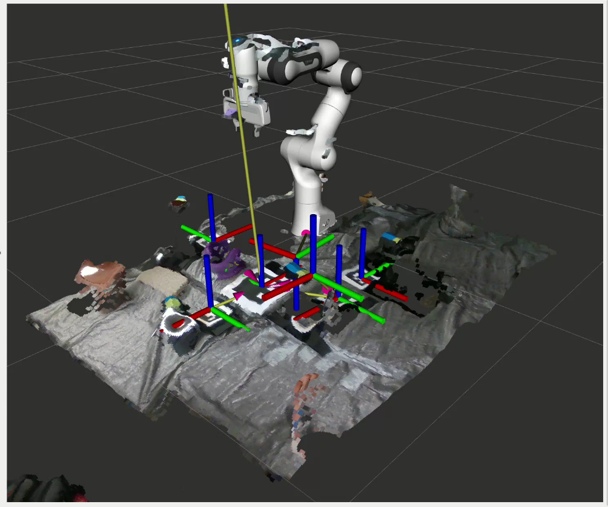
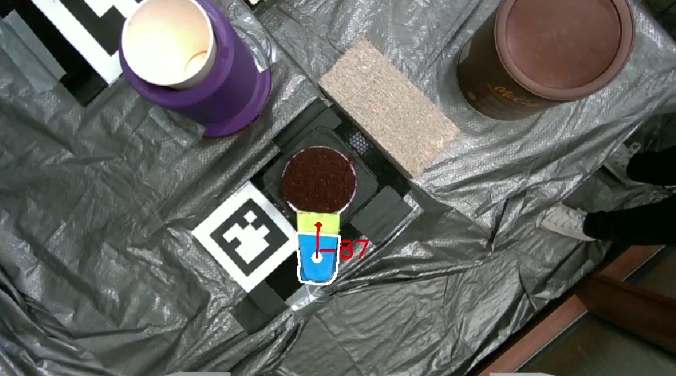
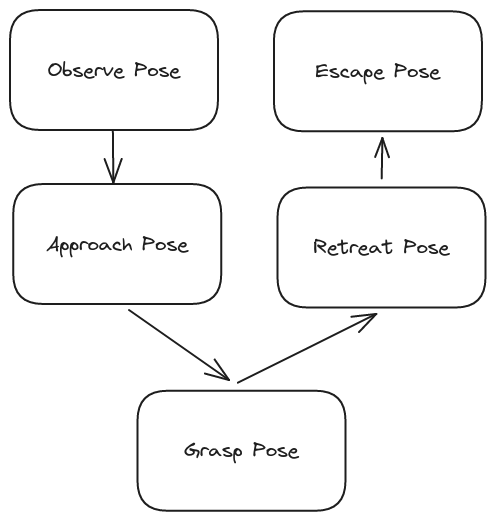

import { YouTube } from 'mdx-embed'
import { Divider } from 'theme-ui'

# Botrista
<Divider/>

    <YouTube youTubeId="INRJ8Y_SD4U" autoPlay="true" />

Botrista (robot-barista) is a seven degree of freedom Franka Emika Panda robot arm
that makes pour over coffee. It was made as the final project for Mechanical Engineering
495 - Embedded Systems in robotics taught by Dr. Elwin. Each team was a group of five students and
we were given three weeks to complete the project.

My collaborators were:
- [Anuj Natraj](https://anujn9.github.io/)
- [Stephen Ferro](https://scferro.github.io)
- [Jihai Zhao](https://jihaizhao.github.io/)
- [Kyle Wang](https://kylew239.github.io/)

Making pour over coffee is mainly a manipulation focused task. To reliably make coffee
a robust grasping process is needed and this leads to three main technical challenges: detecting object 
positions, detecting object handles, and grasping.

 
<Divider/>
 

## Object Positioning

     {}

To be able to manipulate each object we need to know where it is. In a fixed
industrial setting using preprogrammed locations is fine. However being able
to detect the location of the objects dynamically makes it easier to add new objects,
iteratively optimize the workspace, and is robust to objects being knocked or pushed.
To achieve this we used April tags. There is a main "localizer tag" that has a known position relative to the robot which is used
to find the transform from the camera frame to the robot base. 
The camera is a Intel Realsense D435i and it is mounted to the ceiling above the robot to be able to see the whole workspace.
The frames corresponding to each tag are shown in the Rviz screenshot above.

 
<Divider/>
 

## Handle Detection

     {}

The most ideal solution for this problem is somehow detecting the handles directly. The handles for the kettle, pot, filter, and coffee scoop
are all different shapes and sizes, this makes both detecting directly and mounting april tags harder. To overcome this we choose to create a form fitting 
tag from two pieces of different colored tape. In addition to depth from the end effector mounted D405, this allows for detecting the pose and orientation of the handle.
The green tape signifies the 'head' or 'front' of the handle while the blue is the main 'body' and grasp location. The two sections were identified using color thresholding
and their centers were found using the center of mass of the detected contour.

 
<Divider/>
 

## Grasping

     {}

To reliably grasp the object we used a five step process with five poses defined.
1. The robot first goes to an observe pose relative to an objects april tag. Here the
end effector should be able to see the handle and the handle pose is found.
2. From the observe pose goto and approach pose defined relative to the handle. Having an approach 
pose allows you to define the approach direction and orientation. 
3. From approach pose goto the grasp pose also defined relative to the handle. The gripper closes
at this point and the object is grasped.
4. An escape pose defining how you want to 'lift' the object.
5. Finally an optional escape pose. This was useful for maneuvering the robot out of tighter areas of the workspace.

